<details>
<summary>DO_1 - Kubernetes</summary>

1. Create 3 vms with **only-hosted** network adapter
   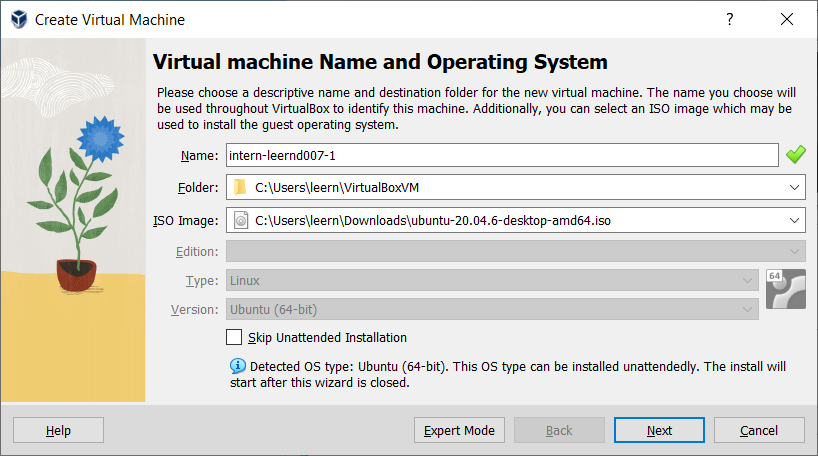
   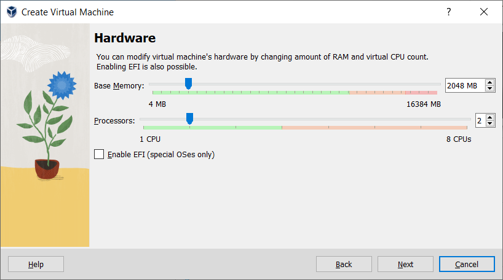

2. On all hosts install additional packages 
    ```
    apt install -y curl wget gnupg sudo iptables
   ```
   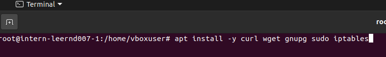

3. On all hosts allow routing of IPv4 traffic and disable swapping
    ```
   cat <<EOF | tee /etc/modules-load.d/k8s.conf
    overlay
    br_netfilter
    EOF
    
    modprobe overlay
    modprobe br_netfilter

    echo -e "net.bridge.bridge-nf-call-ip6tables = 1\nnet.bridge.bridge-nf-call-iptables = 1\nnet.ipv4.ip_forward = 1" > /etc/sysctl.d/10-k8s.conf
    sysctl -f /etc/sysctl.d/10-k8s.conf

    swapoff -a
    sed -i '/ swap / s/^/#/' /etc/fstab
   ```
   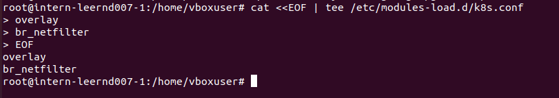
   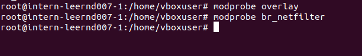
   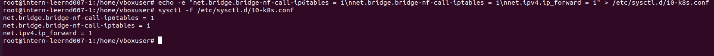
   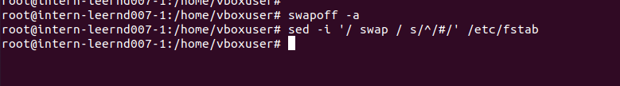

4. On all hosts install Kubelet, Kubectl, Kubeadm
    ```
   curl -s https://packages.cloud.google.com/apt/doc/apt-key.gpg | sudo apt-key add - &&   echo "deb http://apt.kubernetes.io/ kubernetes-xenial main" | sudo tee /etc/apt/sources.list.d/kubernetes.list &&   sudo apt-get update -q
   sudo apt-get install -qy kubelet=1.25.5-00 kubectl=1.25.5-00 kubeadm=1.25.5-00
   ```
   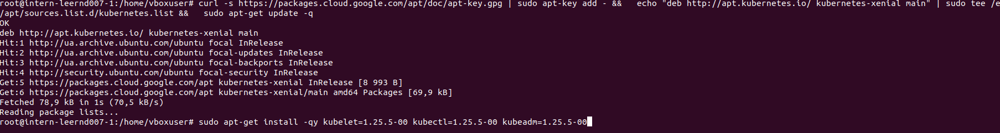

5. On all hosts install Docker + cri-dockerd
    ```
    # Add Docker's official GPG key:
    sudo apt-get update
    sudo apt-get install ca-certificates curl gnupg
    sudo install -m 0755 -d /etc/apt/keyrings
    curl -fsSL https://download.docker.com/linux/ubuntu/gpg | sudo gpg --dearmor -o /etc/apt/keyrings/docker.gpg
    sudo chmod a+r /etc/apt/keyrings/docker.gpg
    
    # Add the repository to Apt sources:
    echo \
    "deb [arch="$(dpkg --print-architecture)" signed-by=/etc/apt/keyrings/docker.gpg] https://download.docker.com/linux/ubuntu \
    "$(. /etc/os-release && echo "$VERSION_CODENAME")" stable" | \
    sudo tee /etc/apt/sources.list.d/docker.list > /dev/null
    sudo apt-get update
   
    sudo apt-get install docker-ce docker-ce-cli containerd.io docker-buildx-plugin docker-compose-plugin
   
    sudo usermod -aG docker $USER
   ```
   
    ```
    wget https://github.com/Mirantis/cri-dockerd/releases/download/v0.3.1/cri-dockerd-0.3.1.amd64.tgz
    tar xvf cri-dockerd-0.3.1.amd64.tgz
    mv cri-dockerd/cri-dockerd /usr/local/bin/
    
    wget https://raw.githubusercontent.com/Mirantis/cri-dockerd/master/packaging/systemd/cri-docker.service
    wget https://raw.githubusercontent.com/Mirantis/cri-dockerd/master/packaging/systemd/cri-docker.socket
    
    mv cri-docker.socket cri-docker.service /etc/systemd/system/
    sed -i -e 's,/usr/bin/cri-dockerd,/usr/local/bin/cri-dockerd,' /etc/systemd/system/cri-docker.service
    
    systemctl daemon-reload
    systemctl enable cri-docker.service
    systemctl enable --now cri-docker.socket
   ```
   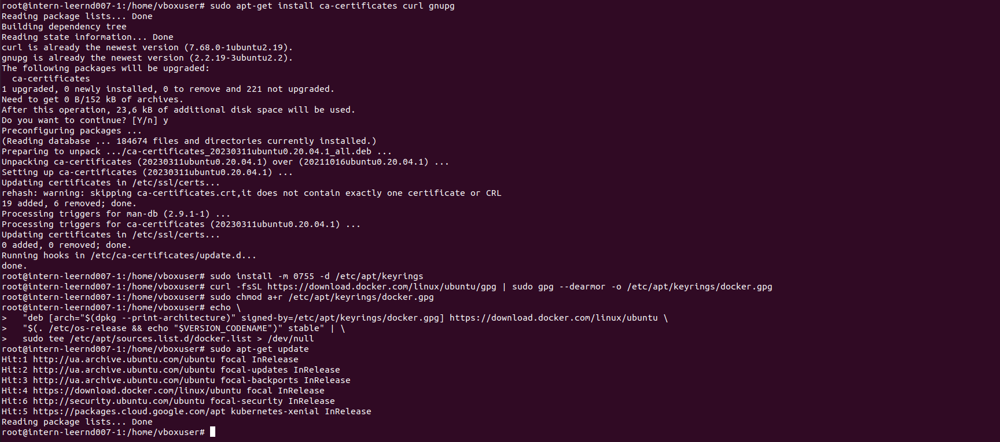
   
   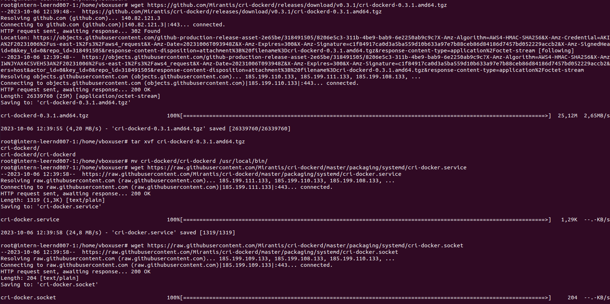

6. On **control** node lets Initialize a Kubernetes cluster, it will return some part of code which need to run on all **working** nodes
    ```
    kubeadm init \
   --cri-socket unix:///var/run/cri-dockerd.sock \
   --pod-network-cidr=10.244.0.0/16 \
   --apiserver-advertise-address=192.168.56.109 \
   --upload-certs
   ```
    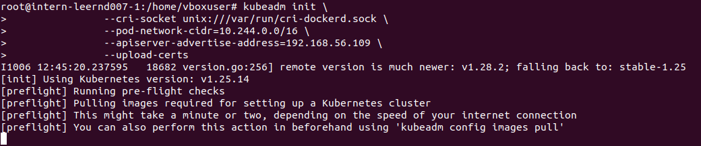
7. On all **working** nodes run returned code from previous step
    ```
    kubeadm join 192.168.56.109:6443 --token 11v0sl.i9kduy3hepgejys8 \
   --discovery-token-ca-cert-hash sha256:8244220e1c836631f41329040594ac2471cfedf8bc66970276becde64cdd454c \
   --cri-socket unix:///var/run/cri-dockerd.sock
   ```
   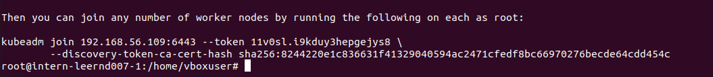
   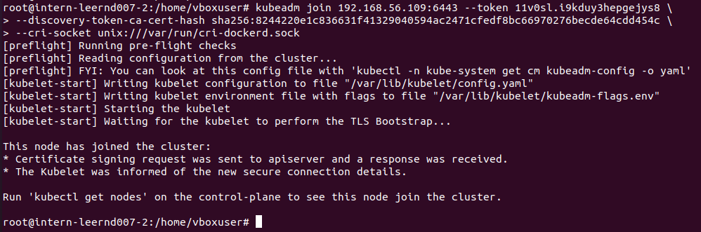

8. On **control** node run 
    ```
    kubectl get nodes
   ```
   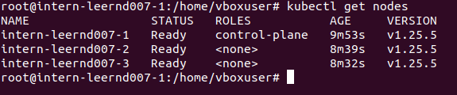

9. On all nodes configure the kubectl management utility
    ```
    echo "export KUBECONFIG=/etc/kubernetes/admin.conf" > /etc/environment
    export KUBECONFIG=/etc/kubernetes/admin.conf
   ```
   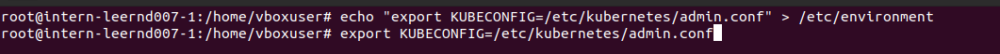

10. On **control** node install **flannel** plugin
    ```
    kubectl apply -f https://raw.githubusercontent.com/coreos/flannel/master/Documentation/kube-flannel.yml
    ```
    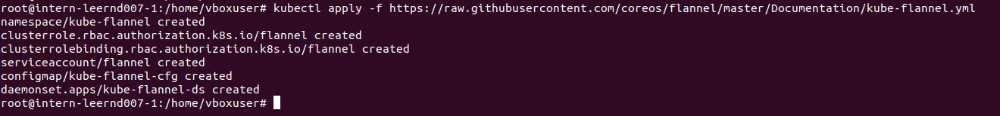
</details>